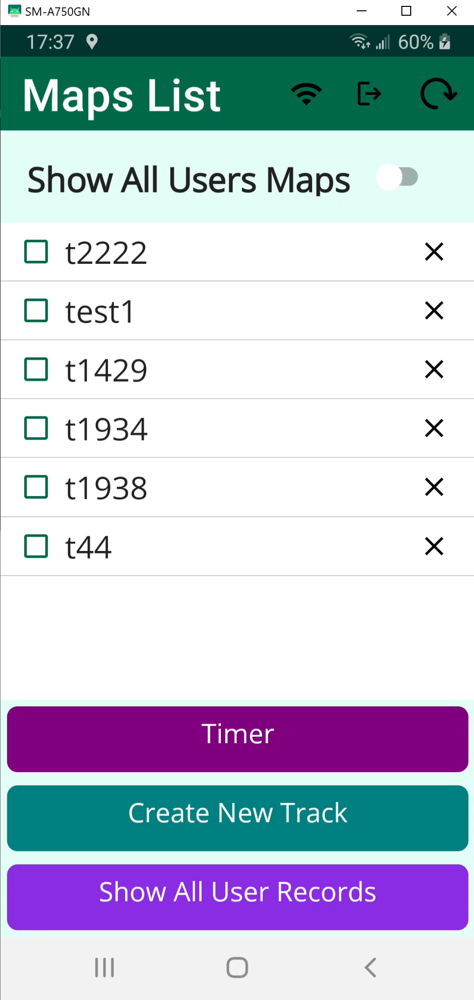
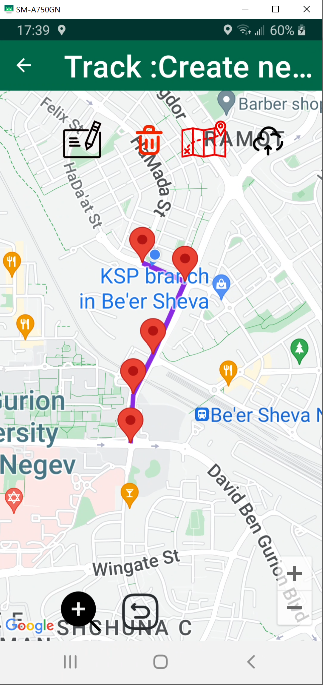
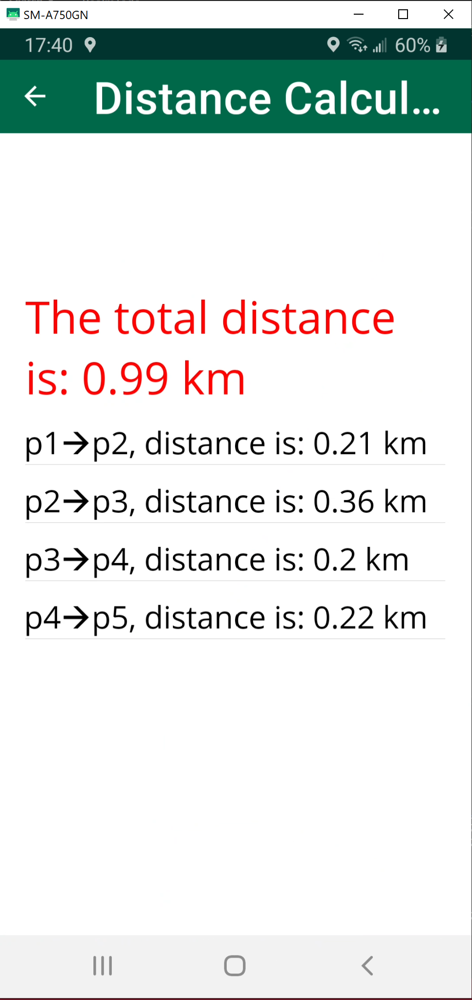
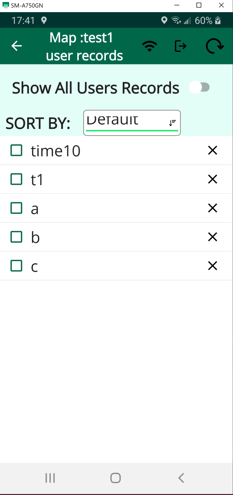
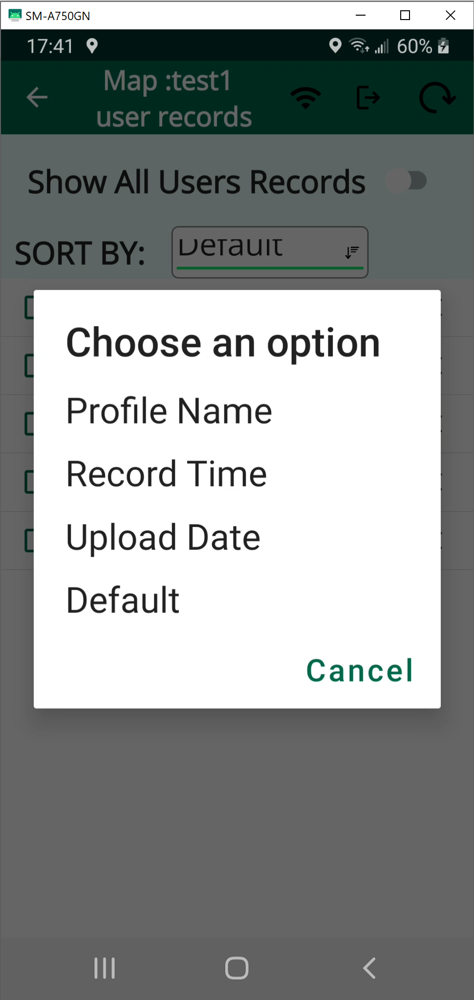

# Running App with Google Maps

## Overview

## Screenshots

<div style="display: flex; justify-content: space-between;">
    
    
</div>

<div style="display: flex; justify-content: space-between;">
    
    
</div>





This is an Android application built using .NET MAUI and C#. It leverages Google Maps to provide a seamless running experience for users. The app allows users to register and authenticate via MongoDB Atlas. Once registered, users can create running routes, share them with others, and compare their running times. The application also enables sorting of records based on running time or the date of upload.

## Features

- **User Registration & Authentication**: Secure login and registration using MongoDB Atlas.
- **Route Creation & Sharing**: Users can create running routes and share them with others.
- **Google Maps Integration**: Plan and visualize running routes with Google Maps.
- **Performance Comparison**: Compare running times with other users.
- **Sorting & Filtering**: View and sort records by running time or upload date.

## Technologies Used

- **.NET MAUI** - Cross-platform framework for building native applications.
- **C#** - Core programming language for the application.
- **Google Maps API** - Used for map visualization and route planning.
- **MongoDB Atlas** - Cloud-based database for user authentication and data storage.

## Installation

1. Clone this repository:
   ```sh
   git clone https://github.com/your-username/your-repository.git
   ```
2. Open the project in Visual Studio.
3. Ensure that all dependencies are installed.
4. Configure the MongoDB Atlas connection.
5. Run the application on an Android emulator or a physical device.

## Usage

1. Register or log in to the app.
2. Create a new running route using the map interface.
3. Save and share your route with other users.
4. Compare running times and sort records by time or upload date.


## Contact

For any inquiries or support, please reach out via [tomer.polsky27\@gmail.com].

